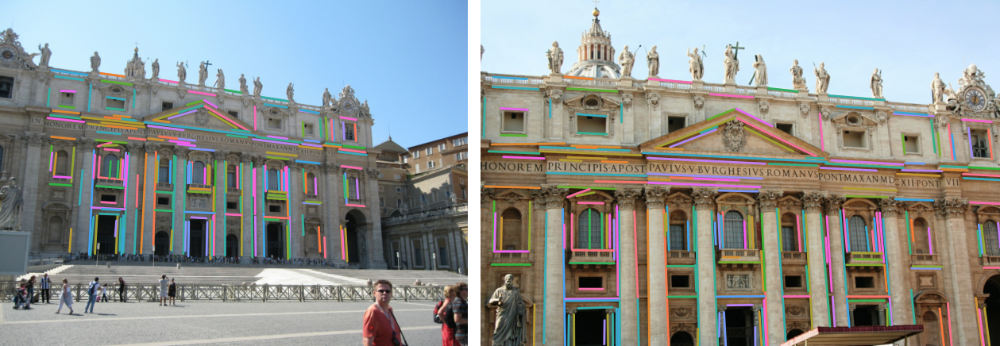
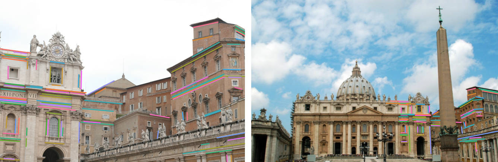

    

  <h1 align="center"><ins>LightGlueStick</ins> Fast and Robust Joint Point-Line Matching</h1>
  <h2 align="center">
    
Accepted at ICCVW 2025

    <a href="#" align="center">Paper (coming soon)</a>
  </h2>
  
<em>Codebase under active development.</em>

  
   
  

  LightGlueStick adaptively adjusts its depth based on image difficulty, exiting after the 4th layer for the top image pair (easy) and the 7th layer for the bottom pair (hard). These pairs are processed in just 27ms and 42ms, respectively.

